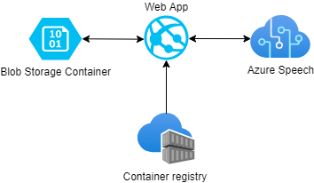

# Azure-Audio-Translator

## Architecture

___
## Problems during deployment
|
### Problem #1
There is no possibility to auto-deploy Azure Web Application through Git repository because of missing **librasound2** library that cannot be installed (module **azure-cognitive-services** isn't working without this library).

Error: `ModuleNotFoundError: No module named '_speech_py_impl'`

|
### Problem #2
Python module **azure-cognitive-services** doesn't work with Linux docker images distributed by Microsoft (even with librasound2 library installed).

Error: `ModuleNotFoundError: No module named '_speech_py_impl'`

|
### Problem #3
Python module **azure-cognitive-services** doesn't support ARM architecture, so there is no possibility to create Docker container on laptops with ARM (in our case it was Macbook Air M1).

|
### Solution
We've used Linux-based laptop and created Docker image from standard **Ubuntu 18.04**, manually installing all required libraries and modules. Docker image was uploaded to Azure Container Registry and then hosted as Azure Web Application.

___

## Functionality

Application allows user to upload .wav audio file throught website and translate speech recognized in this audio.

After uploading audio file it goes to Azure Blob Storage Container and then it got transfered to our docker container which uses Azure Speech for translation.

Application has been written in Python with Flask framework and HTML template.
___

## Azure services
- Azure Storage
- Azure WebApp
- Azure Speech from Cognitive services
- Azure Container Registry

___

## Technologies
- Python 3.7, Flask
- Docker
- HTML, CSS

___

## Made by:
- https://github.com/kolomieo
- https://github.com/u-hubar